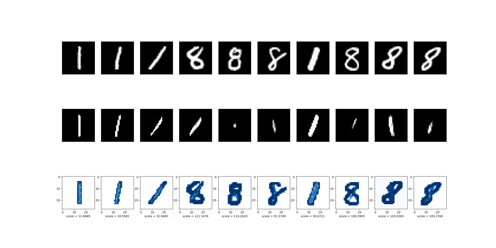

# Anomaly detection for MNIST

In this repository you can test Autoencoder and Variational Autoencoder code developed by PyTorch
## Run
### Prepare virtual environment
```conda create -n autoencoder python=3.9```
```pip install -r requirements.txt```
### Run experiment
```python train.py```

You can set any configuration by changing ```config``` in ```train.py```

### Result example

